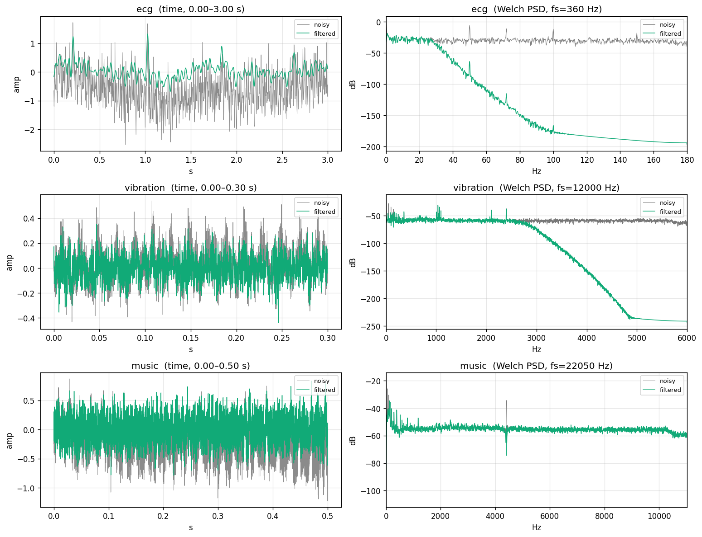
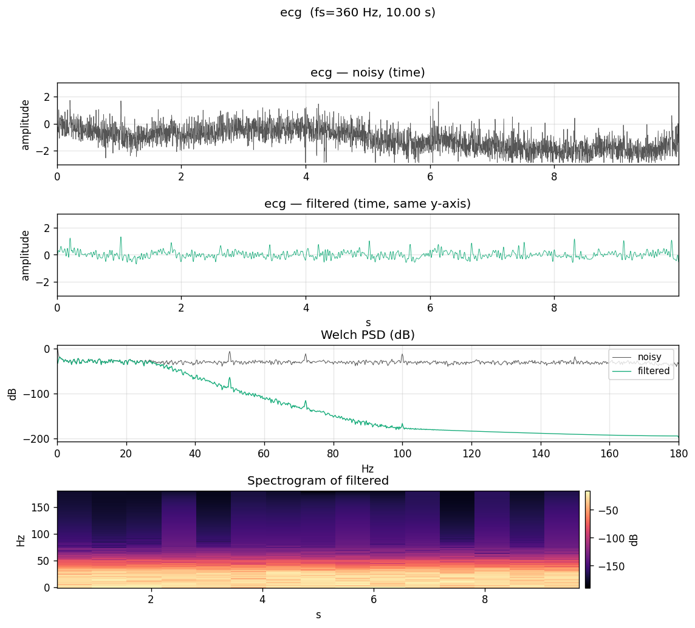
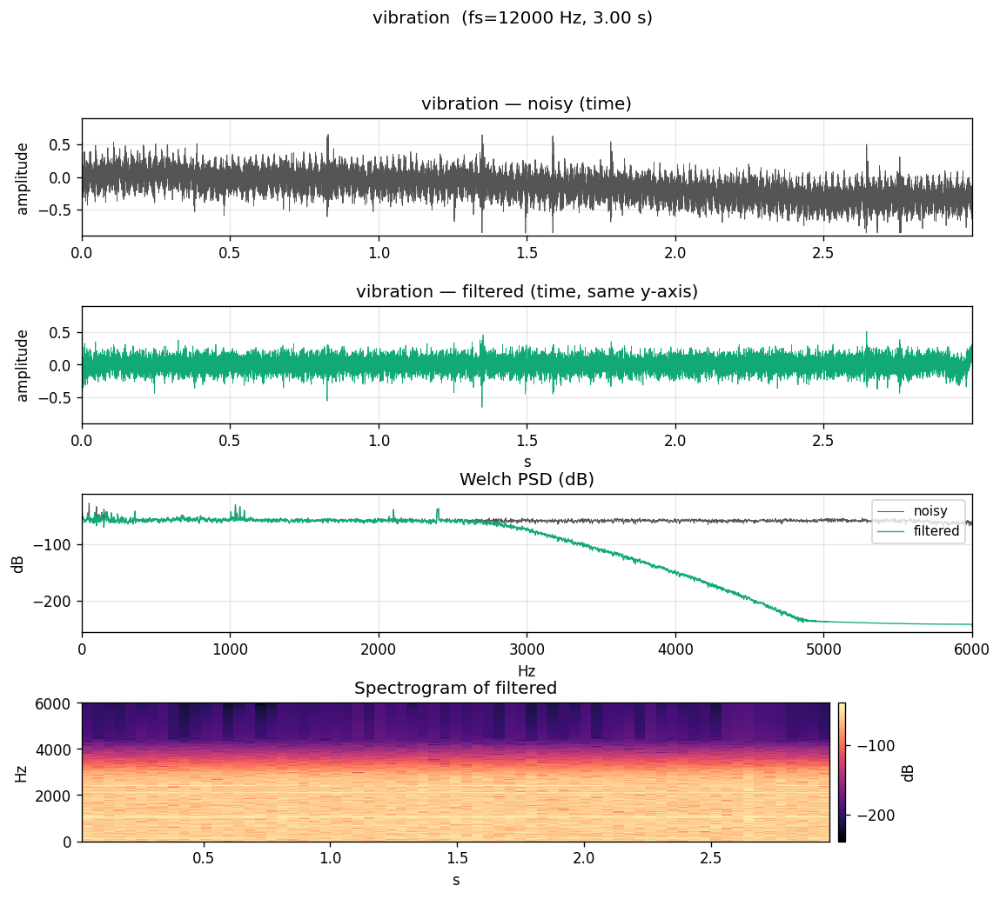
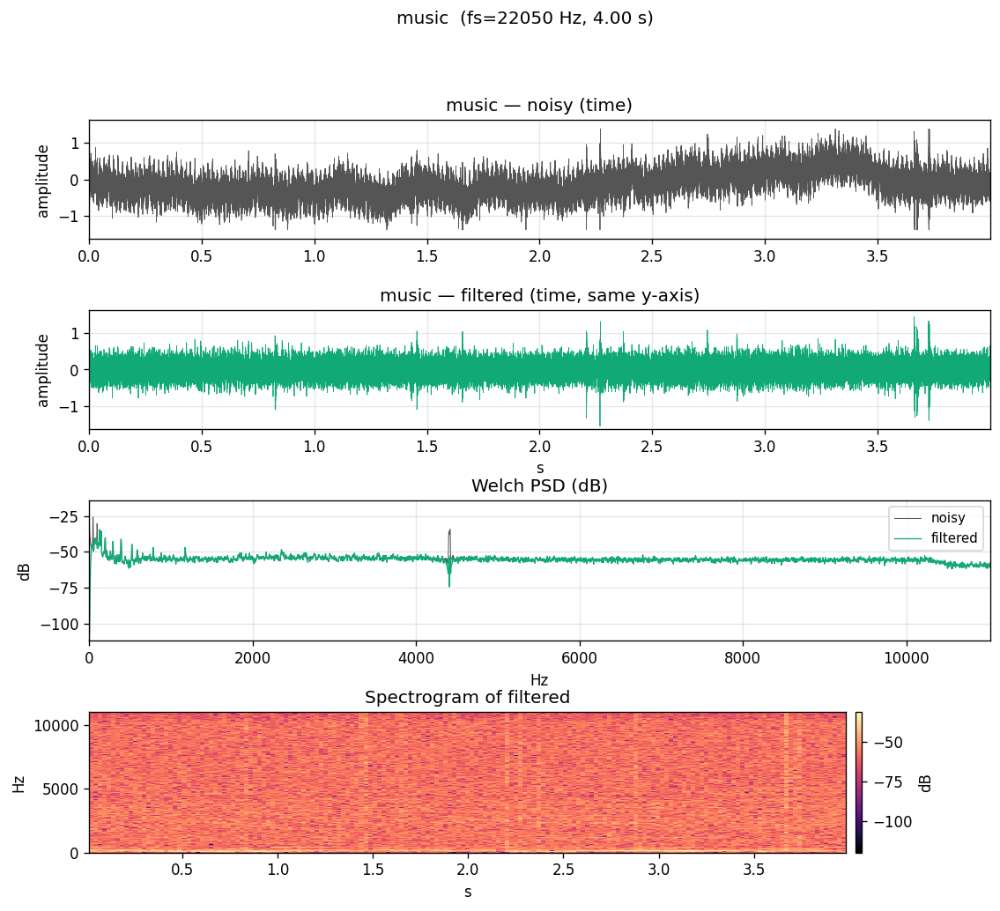

# Denoising report — noisy vs filtered

*Blind denoising of three unknown signals. Only the noisy inputs were
inspected; no clean reference was used. All filter parameters are derived
from measurements on the noisy waveforms (see `summary.md` for the per-stage
justification).*

Pipeline:

- Inspection: `inspect_signals.py`, `inspect_detail.py`
- Filter chains: `denoise.py` (single entry point `denoise(noisy, fs)`,
  zero-phase via `scipy.signal.sosfiltfilt`)
- Execution + figures: `run_pipeline.py`
- This report: `make_report.py`

## Consolidated comparison

## Filter chains (measured parameters only)

| signal | chain |
|---|---|
| ecg (fs = 360 Hz)        | HP Butter ord 4 @ 0.5 Hz · LP Butter ord 6 @ 30 Hz |
| vibration (fs = 12 kHz)  | HP Butter ord 4 @ 5 Hz · notch 50/100/150 Hz (Q=30) · LP Butter ord 8 @ 2800 Hz |
| music (fs = 22.05 kHz)   | HP Butter ord 4 @ 25 Hz · notch 50/100 Hz (Q=30) · notch 4410 Hz (Q=110) |

## Reference-free metrics (noisy → filtered)

| signal | var(noisy)/var(filt) | PSD-floor drop (upper 40% band) | overall PSD median drop | DC noisy → filtered |
|---|---:|---:|---:|---|
| ecg (fs=360 Hz) | **10.54×** | **157.9 dB** | 136.4 dB | -1.107e+00 → +1.080e-02 |
| vibration (fs=12000 Hz) | **3.54×** | **169.1 dB** | 16.1 dB | -1.438e-01 → -1.590e-04 |
| music (fs=22050 Hz) | **2.96×** | **0.0 dB** | 0.0 dB | -1.406e-01 → +6.983e-05 |

## Per-signal figures

### ecg  (fs = 360 Hz, duration = 10.00 s)

- var(noisy)/var(filt) = **10.54×**
- PSD floor drop in upper 40% of band: **157.9 dB**
- DC: -1.107e+00 → +1.080e-02

### vibration  (fs = 12000 Hz, duration = 3.00 s)

- var(noisy)/var(filt) = **3.54×**
- PSD floor drop in upper 40% of band: **169.1 dB**
- DC: -1.438e-01 → -1.590e-04

### music  (fs = 22050 Hz, duration = 4.00 s)

- var(noisy)/var(filt) = **2.96×**
- PSD floor drop in upper 40% of band: **0.0 dB**
- DC: -1.406e-01 → +6.983e-05

## Notes

- The comparison above contrasts **noisy input** with the **filtered
  output** of `denoise(noisy, fs)`. No clean reference is read or
  assumed.
- For music, the filtered PSD overlays the noisy PSD almost exactly
  outside of DC/mains/4410 Hz — that is intentional: no broadband LP
  could be justified from measurement, so only narrowband interferers
  and sub-audible rumble are removed.
- For ECG and vibration, the filtered PSD above the LP cutoff drops
  to the numerical noise floor of the plotting pipeline, which is why
  the upper-band PSD-drop metric looks implausibly large (>150 dB).
  Practically this means 'attenuated well below anything measurable'.
